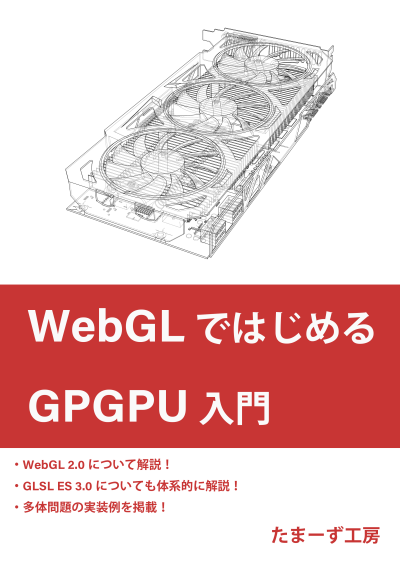

# WebGLではじめるGPGPU入門

## 著者
  * tama
    * GitHub: [@ttk1](https://github.com/ttk1)
    * Twitter: [@mscle11](https://twitter.com/mscle11)
  * Happinessfield
    * GitHub: [@yasuda0102](https://github.com/yasuda0102)
    * Twitter: [@Happinessfield](https://twitter.com/Happinessfield)

## 目次

* 前書き
* 第1章 はじめに
  * なぜWebGLなのか
  * 物理エンジンとGPGPU
  * 本書の構成
* 第2章 WebGL入門
  * WebGLとは
  * WebGLの特徴
  * グラフィックスパイプライン
  * OpenGL Shading Language（GLSL）
  * プログラムの流れ
  * 環境構築
* 第3章 GPGPU
  * GPGPUとは何か？
  * なぜ計算が高速なのか？
  * WebGLでGPGPUをやるために必要な知識
  * Transform Feedbackを用いた計算サンプル
* 第4章 物理エンジン: 多体問題
  * 多体問題とは何か？
  * WebGLプログラムの実装
  * 計算のためのシェーダの実装
  * 考察
* あとがき

## ソースコード

本書で紹介したコードはこちらからダウンロードできます。

* [sample.html](https://github.com/ttk1/tamas-workshop/tree/master/m2tb/sample01.html)
  * [デモ](./sample01.html)
* [WebGLTemplate](https://github.com/ttk1/WebGLTemplate)
